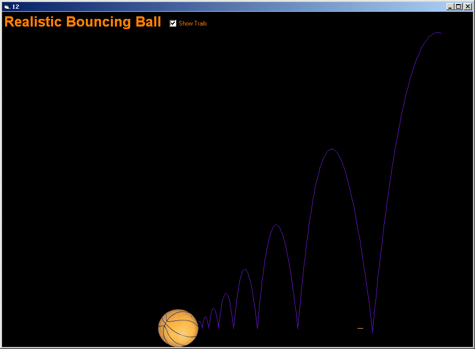



## Realistic Bouncing Ball

### Description

A realistic, interactive bouncing ball algorithm. You click on the ball and throw it within the window. It displays the trail of motion for a fancy effect. Uses constants: bounce coefficient, air resistance and ground resistance. This code is adapted from Doug Pucketts bouncing balls screensaver at http://www.Planet-Source-Code.com/vb/scripts/ShowCode.asp?txtCodeId=13701&amp;lngWId=1 with changes to his bounce algorithm. Thanks. ** UPDATE: Uploaded Version with trails **
 
### More Info
 

             |
---                |---
**Submitted On**   |2005-08-19 16:52:04
**By**             |[Happy Lobster](https://github.com/Planet-Source-Code/PSCIndex/blob/master/ByAuthor/happy-lobster.md)
**Level**          |Advanced
**User Rating**    |4.7 (14 globes from 3 users)
**Compatibility**  |VB 5\.0, VB 6\.0
**Category**       |[Games](https://github.com/Planet-Source-Code/PSCIndex/blob/master/ByCategory/games__1-38.md)
**World**          |[Visual Basic](https://github.com/Planet-Source-Code/PSCIndex/blob/master/ByWorld/visual-basic.md)
**Archive File**   |[Realistic\_1926258222005\.zip](https://github.com/Planet-Source-Code/happy-lobster-realistic-bouncing-ball__1-62238/archive/master.zip)

